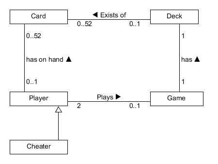
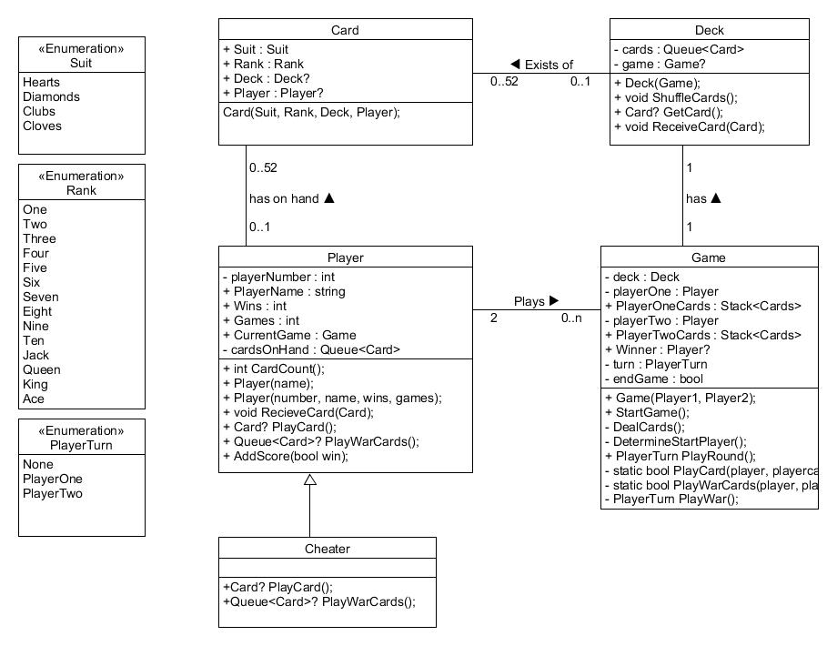
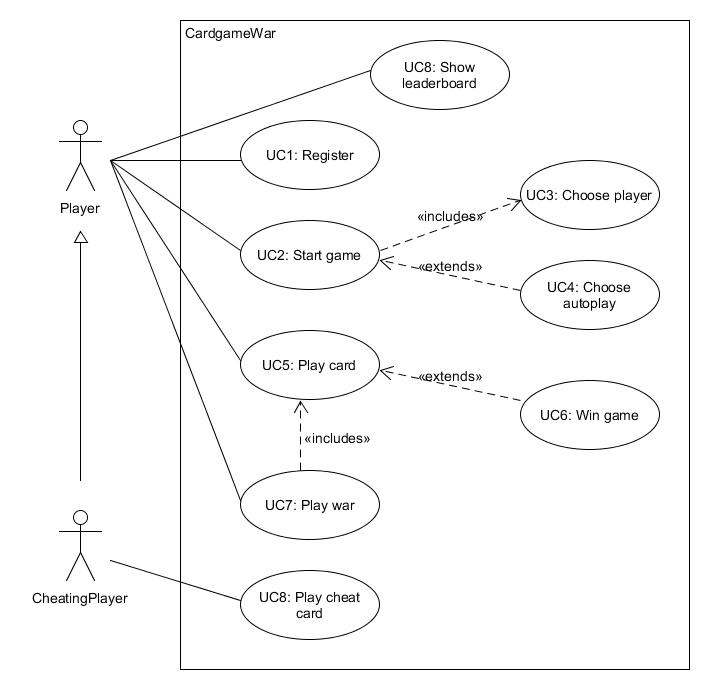
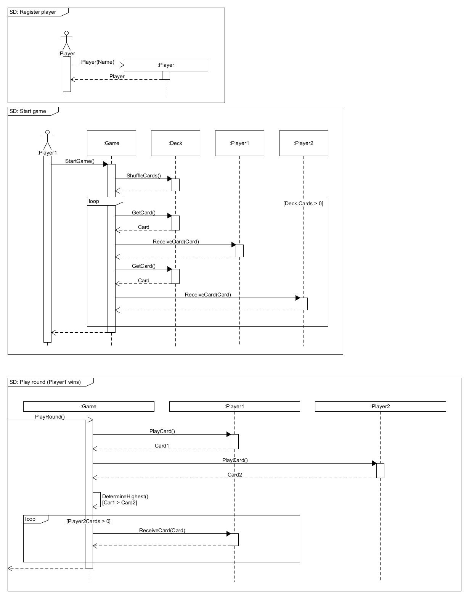

# CardGameWar

## Speluitleg
Oorlog is een kaartspel dat meestal door twee spelers wordt gespeeld en het doel is om alle kaarten te verzamelen. Hier zijn de regels voor het kaartspel oorlog:

- Het spel wordt gespeeld met een standaard deck van 52 kaarten zonder jokers. De kaarten worden geschud en verdeeld over de twee spelers.
- De spelers draaien elk de bovenste kaart van hun stapel om. De speler met de hoogste kaart wint de ronde en verzamelt de twee kaarten. De kaartwaarden worden als volgt gerangschikt: Aas (hoogste kaart), Koning, Vrouw, Boer, 10, 9, 8, 7, 6, 5, 4, 3, 2.
- Als beide spelers kaarten hebben van gelijke waarde, dan begint er een "oorlog". Elke speler legt dan drie kaarten met de rug naar boven op de tafel en draait de vierde kaart om. De speler met de hoogste kaart wint de oorlog en verzamelt alle kaarten van die ronde. Als de kaarten weer gelijk zijn, dan wordt dit proces herhaald.
- Het spel gaat door totdat één speler alle kaarten heeft verzameld. Die speler wint het spel.

Oorlog is een zeer eenvoudig spel zonder veel strategie of tactiek, maar het is leuk om te spelen voor kinderen en beginners die net beginnen met het spelen van kaartspellen.

## Requirements

### Constraints
Onderstaande zijn randvoorwaarden, geen requirements.
- Gegevens worden opgeslagen in Microsoft SQL server
- De applicatie wordt geprogrammeerd in dotnet core met winforms
- Geldende wetgeving wordt nageleefd (eigenlijk overbodig te vermelden)

### Functionele requirements
- Requirements geïdentificeerd door nummering met afkorting betekenend: **P**layer, **G**ame, **T**urn, **O**verall
- Prioritisering middels MoSCoW. Zie ook:[MoSCoW](https://nl.wikipedia.org/wiki/MoSCoW-methode). 
- Opdrachtgever is eigenaar van alle requirements.
- Requirements vloeien allen voort uit de bovenstaande speluitleg en doelstelling van het project.

| Nummer | MoSCoW | Beschrijving |
|:--- |:---- |:----|
|P1| **S**hould have |De speler registreert een unieke naam|
|P2| **S**hould have |De speler slaat zijn gegevens op|
|G1| **C**ould have |De speler beëindigt een spel|
|G2| **M**ust have |De speler kiest een tegenspeler|
|G3| **M**ust have |De speler start een nieuw spel|
|G4| **M**ust have |Het spel heeft een standaard deck van 52 kaarten zonder jokers|
|G5| **M**ust have |De kaarten in het deck hebben een oplopende waarde van 2, 3, 4, 5, 6, 7, 8, 9, 10, B, V, H, A.|
|G6| **M**ust have |De kaarten worden evenredig random verdeeld|
|G8| **S**hould have |Het spel bepaalt random de startspeler|
|G9| **M**ust have |Het spel eindigt zodra één speler geen kaarten meer heeft|
|G10| **M**ust have |Het spel roept de winnaar uit |
|G11| **S**hould have |Het spel werkt de persoonlijke score van de speler bij|
|T1| **M**ust have |De speler speelt de eerste kaart van zijn stapel op tafel|
|T2| **M**ust have |De speler met de hoogste kaart wint alle kaarten op tafel|
|T3| **M**ust have |De gespeelde kaart is van gelijke waarde waardoor oorlog wordt gevoerd|
|T3.1| **M**ust have |De speler speelt vier kaarten van zijn stapel bij het voeren van oorlog|
|T3.2| **M**ust have |De waarde van de vierde kaart bepaalt wie de winnaar is|
|T4| **M**ust have |De speler legt alle gewonnen kaarten onderaan zijn stapel speelkaarten|
|T5| **C**ould have |Een speler kan vals spelen|
|T5.1| **C**ould have |De valsspeler speelt in zijn beurt indien beschikbaar een kaart uit zijn stapel die hoger is dan de door de tegenstander gespeelde kaart|
|O1| **C**ould have |De speler bekijkt de score van alle spelers van hoge score naar lage score|
|O2| **C**ould have |Het spel kan automatisch gespeeld worden zonder gebruikers interactie (kaarten worden automatisch gelegd)|
|O3| **C**ould have |De speler slaat het spel tussentijds op|
|O4| **C**ould have |De speler laadt een eerder opgeslagen spel|

### Niet functionele requirements
Niet functionele requirements gaan over kwaliteitskenmerken zoals omschreven in [ISO25010](https://nl.wikipedia.org/wiki/ISO_25010)
- De code is herbruikbaar voor een toekomstige web applicatie (reusability)

## Ontwerp
Ontwerpen zijn gemaakt met UMLet en opgeslagen in de map "Design".
### Conceptueel class diagram

### Implementatie class diagram

### Usecase diagram

### Usecase desciptions
| Usecase | UC1: Register ||
|:------------- |:-------------|:-|
| **Beschrijving**  | Speler registreert een unieke naam|
| **Actor** |Speler|
| **Trigger(s)** |De speler klikt op de button "Create new player"|
| **Pre-Conditions** | - Er is geen lopend spel|
| **Post-Conditions** | - Spleler is opgeslagen met een unieke naam||
| **Stappen** |**Actor speler**|**Systeem**|
| |1. Speler klikt op de button "Create new player"||
| ||2. Systeem toont de nieuwe speler dialog 
| |3. Speler vult een unieke naam in||
| |4. Speler klikt op ok||
| ||5. Systeem controleert of unieke naam al bestaat
| ||6. Systeem slaat de gegevens op
| ||7. Systeem geeft resultaat succes melding
| |8. Speler klikt op cancel||
| ||9. Systeem geeft foutmelding
| **Main success scenario**|1, 2, 3, 4, 5, 6, 7|
| **Alternatieve scenario's**|1, 8   1, 2, 3, 4, 5, 9|

| Usecase | UC2: Start game ||
|:------------- |:-------------|:-|
| **Beschrijving**  |Speler start het spel|
| **Actor** |Speler|
| **Trigger(s)** |De speler wilt een spel starten|
| **Pre-Conditions** |- Er is geen lopend spel   - Er zijn minimaal twee spelers aangemaakt|
| **Post-Conditions** |||
| **Stappen** |**Actor**|**Systeem**|
| |1. Speler kiest twee spelers ||
| |2. Speler klikt op "Create game" om het spel aan te maken ||
| ||3. Het systeem maakt het spel aan
| |4. Speler klikt op "start game" om het spel te starten ||
| ||5. Het systeem schudt het deck
| ||6. Het systeem deelt de kaarten
| **Main success scenario**| 1, 2, 3, 4, 5, 6|
| **Alternatieve scenario's**||

### Sequence diagrams

### Wireframes
// todo

## Verdieping
Verdiepingsopdrachten voor studenten.
Maak een fork van deze repository en kies één van de onderstaande opdrachten. Idealiter 
- Implementeer requirement T5 en T5.1, de valsspeler (oefenen met afgeleide classes en polymorfisme)
- Implementeer requirement O3 en O4, savegame (oefenen met database en DAL)
